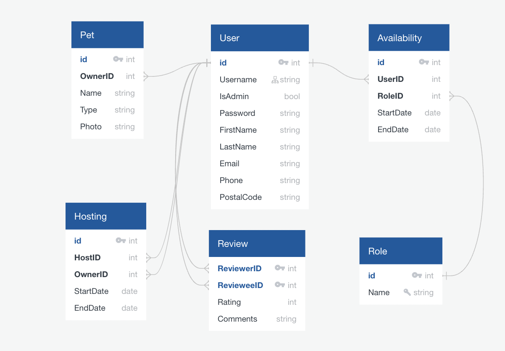

# Host A Pet

## Purpose
With the pandemic, the number of people who adopted pets increased drastically. Unfortunately, the number of people recently returning pets to the stores increased significantly. 

What if before you adopted a pet, you could host a pet for someone that is going away (on a trip, for example) and needs a pet sitter?

Pet owners would feel comfortable knowing their furry friends are being taken care of. At the same time, people who are considering adopting a pet, can experience what it's like to have a pet (feed, take for a walk, pick up after them, etc.) before making a final decision.
  

## Audience
The website can potentially be visited by pet owners who are looking for pet sitters and by pet hosts - people who are considering adopting a pet and would like to have a glimpse of what pet ownership means (including involving kids in daily routines with the pets).

## Data / API
This will be a full-stack application with its own database using PostgreSQL. Front-end will be built using React, and the back-end will be built using Node/Express. In order to calculate distance between pet owners and hosts, the application will use the [ZipCode API](https://www.zipcodeapi.com/) (future enhancement). The API provides Canadian postal codes and US zip codes within a specified radius (in kilometers or miles) from a given postal/zip code. The free API key is restricted to 10 requests per hour, which should be enough for the purpose of this project.

Here is an example of what a JSON response from the API looks like:

```
{
	"postal_codes": [
        {
            "postal_code": "T2Y 3X8",
            "distance": 0,
            "city": "Calgary",
            "province": "AB"
        },
        {
            "postal_code": "T2Y 3X7",
            "distance": 0.056,
            "city": "Calgary",
            "province": "AB"
        },
        {
            "postal_code": "T2Y 3T2",
            "distance": 0.089,
            "city": "Calgary",
            "province": "AB"
        },
        {
            "postal_code": "T2Y 3T3",
            "distance": 0.114,
            "city": "Calgary",
            "province": "AB"
        },
        {
            "postal_code": "T2Y 3P2",
            "distance": 0.119,
            "city": "Calgary",
            "province": "AB"
        }
    ]
}
```

## Approach

### Database Schema
The application will make use of the following tables: User, Pet, Role, Availability, Hosting, and Reviews, according to the schema below.




### Potential issues
Users need to register in order to be able to use the app. Therefore, access to routes should only be available to registered/logged users. Users should also be able to edit their own profiles and request password reset for themselves **only**.

### Sensitive information
The database will store user password that will be encrypted with `bcrypt` before it's stored in the database. User authentication will be done using JWT.

### Functionality
The application will allow any registered/logged user to view available pets to host and available hosts for their pets. Search will be based primarily on two criteria: 

* Host a pet or looking for someone to host their pet;
* Date;

As a future enhancement, once search results are available, users can select a maximum distance to filter results, and then decide whether to book a hosting. 

### User Flow / UX
From the home page, users will have the option to register or log in. Once logged in, users will be presented with the home page and the navigation bar at the top will show options available for the user (including admin panel if user has admin privileges). The form will prompt whether the user is looking to host a pet or looking for someong to host their pet and the desired dates. 

In a future enhancement, users will have the option to filter results by distance. If the user finds a match, they can proceed with the booking. Once a booking is created, both the host and the pet owner can write a review for that hosting event.  

### More than just CRUD
The website will offer a personalized experience for users who are looking for someone to look after their pets and for someone willing to host a pet. For hosts, the experience of hosting can be even more valuable if they are considering adopting a pet: their kids can get involved and learn about the responsibility/accountability that comes with pet ownership. Users can be proud of the reputation they build within the app community as they get high ratings for their hosting events.

### Technologies used

* React;
* JavaScript;
* Saas;
* Node
	* Express;

#### Live App: https://host-a-pet.surge.sh/
